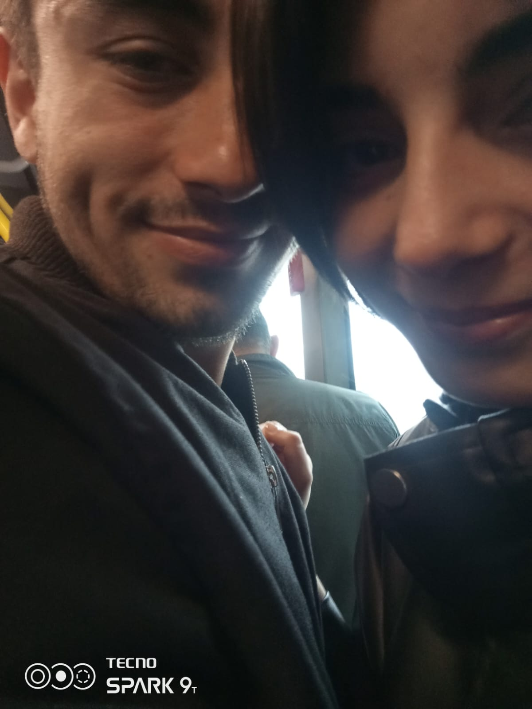

<!DOCTYPE html>
<html lang="tr">
<head>
    <meta charset="UTF-8">
    <title>Seninle Geleceğe</title>
    
</head>
<body>

    

        <h1>Seninle Bir Gelecek Hayal Ediyorum</h1>

        

            
            
Sen gülümsediğinde, dünya biraz daha güzel oluyor.

        

        

            
            
Seninle kuracağım hayatı sabırsızlıkla bekliyorum.

        

        

            
Sen sadece bugünüm değil, yarınımsın. Bir gün seninle bir aile kurmak, seni çocuklarımın annesi olarak görmek... işte o hayali yaşatıyorsun bana. Her geçen gün sana daha da aşkla bağlanıyorum.

        

    

    
Yasin Şahin

    <!-- Kalp animasyonları -->
    
❤️

    
❤️

    
❤️

    
❤️

    
❤️

</body>
</html>
